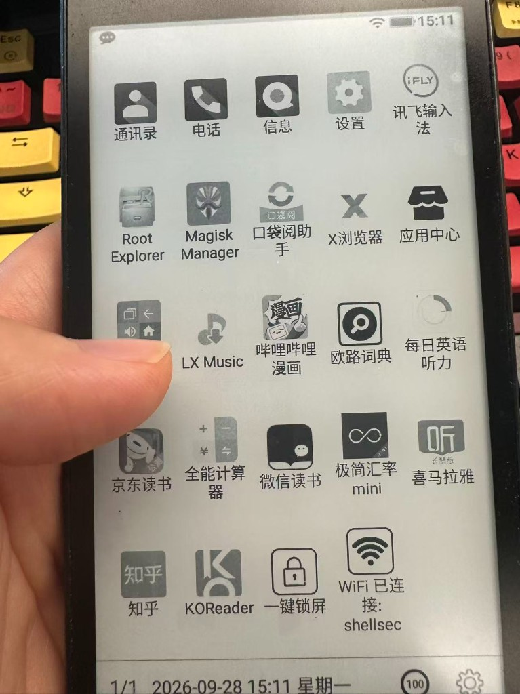
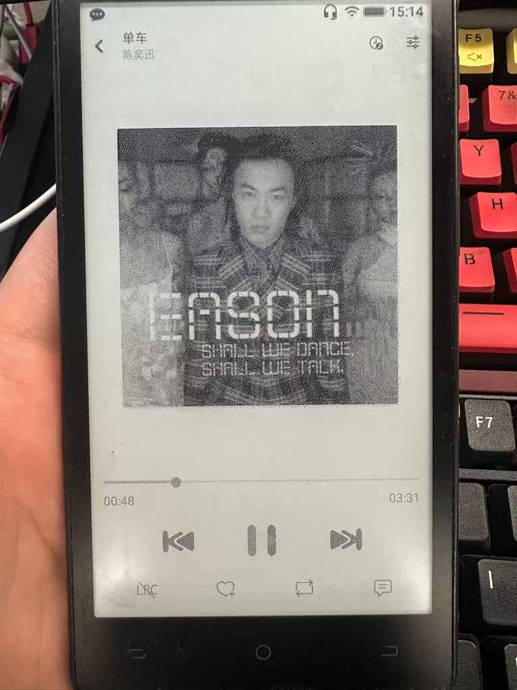
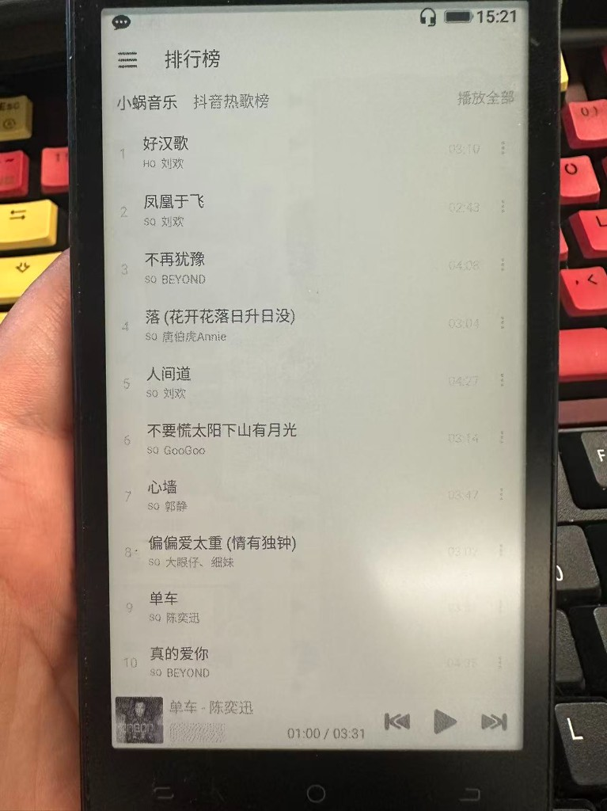

**语言 / Language:** 中文 | [English](README.en.md)

[aiv123.com](https://aiv123.com/) · AI 工具导航，600+ 工具一网打尽

## 🚀 推荐使用 [ofox.ai](https://ofox.io/x/aiv123)

> **一句话**：一个账号直达最新 GPT / Claude / Gemini 等 **100+** 顶尖模型，首充额外赠 **$3** 额度。

文本、图像、视频、向量一站调用；支持缓存，重复请求更省更快。

[👉 注册领取](https://ofox.io/x/aiv123) · 全球专线 · 企业级 SLA · 不留存对话

| ⚡️ 极速更省 | 🧠 模型与模态 | 🛡️ 隐私安全 |
|:---:|:---:|:---:|
| 全球专线，企业级 SLA，支持缓存 | 100+ 模型 · 文本 / 图像 / 视频 / 向量 | 不留存任何对话 |

## ☕ 请我喝可乐

开源不易，欢迎赞助支持：  
👉 [爱发电](https://ifdian.net/a/shellsec)

---

<p align="center"><a href="https://github.com/shellsec/lx-music-eink"></a></p>

<h1 align="center">落雪音乐墨水屏版</h1>

<p align="center">
  <a href="https://github.com/shellsec/lx-music-eink/releases"></a>
  <a href="https://github.com/facebook/react-native"></a>
  <a href="https://github.com/lyswhut/lx-music-mobile/tree/dev"></a>
</p>

<p align="center">构建状态见上游：<a href="https://github.com/lyswhut/lx-music-mobile">洛雪音乐移动版</a></p>

<p align="center">落雪音乐墨水屏版，基于 React Native，fork 自洛雪音乐移动版。</p>

### 优点

**已集成音源，安装即可播放，失败时自动切换。**

已在口袋阅（Android 8.1、仅 `armeabi-v7a`）安装并播放验证通过。本仓库是 Android APK，**不是**硬件屏驱。

桌面（落雪音乐墨水屏版）：



播放页：



排行榜：



### 1. 本仓库已实机验证

| 设备 | 系统 | ABI | 安装包 | 备注 |
|---|---|---|---|---|
| 口袋阅（一代） | Android 8.1 | `armeabi-v7a` | `lx-music-mobile-v1.9.1-armeabi-v7a.apk` | 本仓库安装并播放通过 |

### 2. 按 ABI 选包

根目录同名 APK 为**本地构建产物**，默认不纳入 Git（可自行按下方命令打包，或从 Release 获取）。

| 安装包 | ABI | 用途 |
|---|---|---|
| `lx-music-mobile-v1.9.1-armeabi-v7a.apk`（约 23MB） | `armeabi-v7a` | 口袋阅等 **只有 32 位** 的设备 |
| `lx-music-mobile-v1.9.1-arm64-v8a.apk`（约 26MB） | `arm64-v8a` | 纯 64 位或主推 arm64 的墨水屏 |

包名 `cn.toside.music.mobile`，minSdk 21（Android 5.0+）。32 位包装不上纯 64 位机；64 位包装不上只有 `armeabi-v7a` 的口袋阅。不确定时在设备上用 CPU-Z /「关于本机」或 `adb shell getprop ro.product.cpu.abi` 自查后再选包。

### 3. 公开资料中的常见 Android 墨水屏

下列仅整理公开来源中的系统/ABI 线索，**均未在本仓库实机验证**，不构成兼容承诺。公开资料未写明 ABI 的，请在设备上自查后再选安装包。

| 型号 / 系列 | 系统（公开资料） | ABI（若已知） | 建议安装包 | 备注与来源 |
|---|---|---|---|---|
| 口袋阅二代 | 基于 Android Go 的 64 位定制系统 | 公开资料未写明 ABI（仅称「64 位系统」），需在设备上自查 | 自查 ABI 后选对应包 | [新浪众测《口袋阅2电纸书评测》](https://zhongce.sina.com.cn/interface/article/view/69740/)、[百度百科「口袋阅」](https://baike.baidu.com/item/%E5%8F%A3%E8%A2%8B%E9%98%85/23464848) |
| 文石 BOOX 多型号（Note / Nova / Leaf / Poke / Max 等） | 因型号而异，常见 Android 6 / 9 / 10 / 11 / 12 / 13 等开放 Android | 公开资料多数未写明 ABI，需在设备上自查 | 自查 ABI 后选对应包 | [BOOX 固件/系统更新页](https://www.boox.com.hk/pages/system-update)（按 Android 大版本列出机型） |
| 文石 BOOX Go 7 | 开放式 Android 13 | CPU-Z 显示 `aarch64`（对应 `arm64-v8a`） | `lx-music-mobile-v1.9.1-arm64-v8a.apk` | [Read with Pro《Boox 文石 Go 7 规格整理》](https://www.readwithpro.com/devices/boox-go-7)（含 CPU-Z：Snapdragon 750G / aarch64） |
| 海信阅读手机 A9 | 基于 Android 11 的 Ink OS（开放，可装第三方应用） | 公开资料未写明 ABI，需在设备上自查 | 自查 ABI 后选对应包 | [IT之家：海信阅读手机 A9 正式发布](https://www.ithome.com/0/617/918.htm) |
| 海信彩墨屏阅读手机 A5C | Android P（Vision 7.0） | 公开资料未写明 ABI，需在设备上自查 | 自查 ABI 后选对应包 | [天极网：海信 A5C 参数页](https://product.yesky.com/product/1093/1093829/param.shtml) |
| 墨案迷你阅 | Android 8.1 | 公开资料未写明 ABI，需在设备上自查 | 自查 ABI 后选对应包 | [腾讯新闻：墨案迷你阅 Plus 上手文](https://news.qq.com/rain/a/20220601A048J500)（文中对比标准版为 Android 8.1） |
| 墨案迷你阅 Plus | Android 11 开放系统 | 公开资料未写明 ABI，需在设备上自查 | 自查 ABI 后选对应包 | [腾讯新闻](https://news.qq.com/rain/a/20220601A048J500)、[IT之家：迷你阅 Plus 软件升级](https://www.ithome.com/0/708/108.htm) |
| Bigme B751 | 开放 Android 11 | 公开资料未写明 ABI，需在设备上自查 | 自查 ABI 后选对应包 | [Bigme 官方商店 B751](https://store.bigme.vip/products/bigme-7inch-b751-black-white-e-reader)、[Good e-Reader：First Look at the Bigme B751](https://goodereader.com/blog/electronic-readers/first-look-at-the-bigme-b751-e-reader) |
| Bigme B751C S / B7 Pro 等新机 | 公开资料称 Android 14 开放系统（具体以机型为准） | 公开资料未写明 ABI，需在设备上自查 | 自查 ABI 后选对应包 | [デイリーガジェット：Bigme B751C S](https://daily-gadget.net/smartphone_tablet/103643/)、[知乎：Bigme B7 Pro](https://www.zhihu.com/tardis/jm/art/1998434246252069236) |
| Meebook（皓擎）M6C | 开放式 Android 11 | 公开资料未写明 ABI，需在设备上自查 | 自查 ABI 后选对应包 | [Read with Pro《Meebook M6C 规格整理》](https://www.readwithpro.com/devices/meebook-m6c) |
| Meebook（皓擎）M8 / M8C 等 | 开放式 Android 14（以机型页为准） | 公开资料未写明 ABI，需在设备上自查 | 自查 ABI 后选对应包 | [Read with Pro《Meebook 皓擎 品牌页》](https://www.readwithpro.com/brands/Meebook%20%E7%9A%93%E6%93%8E) |
| 掌阅 iReader（Ocean / Smart / Light / Neo 等） | 基于 Android 的定制 SmartOS；部分机型可装第三方应用，部分较封闭 | 公开资料未写明 ABI，需在设备上自查 | 自查 ABI 后选对应包；并确认本机是否允许安装第三方 APK | [IT之家：iReader Ocean 4 系列发布](https://www.ithome.com/0/783/530.htm)、[知乎：掌阅怎么选 / 第三方软件](https://www.zhihu.com/tardis/bd/art/689972947) |

**内置音源**（默认「自动切换」）：野花 → 六音 → Huibq → ikun → 野草 → 综合API → 全都要。取播放地址失败时按此顺序换源；成功源仅本会话优先，重启后仍从野花再试。播放器仍走洛雪原链路；榜单/搜索逻辑不变。

**安装**：把对应 APK 放进安装工具的 `File` 目录 → 刷新 → 选「安装 APK」→ 再点该文件。需 Android 5.0+、能装第三方包、能联网。

重新打包（将 `ANDROID_HOME` / `ANDROID_SDK_ROOT` 指向本机 SDK，并在 `android/local.properties` 配好 `sdk.dir`）：

```bat
cd android
gradlew.bat assembleDebug -PreactNativeArchitectures=armeabi-v7a
gradlew.bat assembleDebug -PreactNativeArchitectures=arm64-v8a
```

产物在 `android\app\build\outputs\apk\debug\`，可复制到仓库根目录同名文件。

### 日常开发运行

```bash
npm install
npm run dev
```

## 说明

所用技术栈：

- React Native
- Redux

已支持的平台：

- Android 5 及以上

***注：目前没有计划支持 iOS 和 HarmonyOS NEXT**。*<br>
*桌面版项目地址：<https://github.com/lyswhut/lx-music-desktop>*<br>
*LX Music 项目发展调整与新项目计划：https://github.com/lyswhut/lx-music-desktop/issues/1912*

上游洛雪音乐移动版：[lyswhut/lx-music-mobile](https://github.com/lyswhut/lx-music-mobile)。上游变化请查看[更新日志](https://github.com/lyswhut/lx-music-mobile/blob/master/CHANGELOG.md)。

本软件（墨水屏版）下载请查看 [GitHub Releases](https://github.com/shellsec/lx-music-eink/releases)。

使用常见问题请参阅[移动版常见问题](https://lyswhut.github.io/lx-music-doc/mobile/faq)。

目前本项目的原始发布地址只有 [**GitHub**](https://github.com/shellsec/lx-music-eink/releases)，其他渠道均为第三方转载发布，与本项目无关！请勿到上游洛雪音乐移动版 Release 查找本墨水屏版 APK。

为了提高使用门槛，本软件内的默认设置、UI 操作不以新手友好为目标，所以使用前建议先根据你的喜好浏览调整一遍软件设置，阅读一遍[音乐播放列表机制](https://lyswhut.github.io/lx-music-doc/mobile/faq/playlist)。

### 数据同步服务

从 v1.0.0 起，我们发布了一个独立的[数据同步服务](https://github.com/lyswhut/lx-music-sync-server#readme)。如果你有服务器，可以将其部署到服务器上作为私人多端同步服务使用，详情看该项目说明。

## 贡献代码

本项目欢迎 PR，但为了 PR 能顺利合并，需要注意以下几点：

- 对于添加新功能的 PR，建议在提交 PR 前先创建 Issue 进行说明，以确认该功能是否确实需要；
- 对于修复 bug 的 PR，请提供修复前后的说明及重现方式；
- 对于其他类型的 PR，则适当附上说明。

贡献代码步骤：

1. 参照[源码使用方法](https://lyswhut.github.io/lx-music-doc/mobile/use-source-code)设置开发环境；
2. 克隆本仓库代码并切换至 `dev` 分支进行开发；
3. 提交 PR 至 `dev` 分支。

<!--
## 用户界面

<p></p> -->

## 项目协议

本项目基于 [Apache License 2.0](https://github.com/lyswhut/lx-music-mobile/blob/master/LICENSE) 许可证发行，以下协议是对于 Apache License 2.0 的补充，如有冲突，以以下协议为准。

---

*词语约定：本协议中的“本项目”指 LX Music（洛雪音乐）移动版项目；“使用者”指签署本协议的使用者；“官方音乐平台”指对本项目内置的包括酷我、酷狗、咪咕等音乐源的官方平台统称；“版权数据”指包括但不限于图像、音频、名字等在内的他人拥有所属版权的数据。*

### 一、数据来源

1.1 本项目的各官方平台在线数据来源原理是从其公开服务器中拉取数据（与未登录状态在官方平台 APP 获取的数据相同），经过对数据简单地筛选与合并后进行展示，因此本项目不对数据的合法性、准确性负责。

1.2 本项目本身没有获取某个音频数据的能力，本项目使用的在线音频数据来源来自软件设置内“自定义源”设置所选择的“源”返回的在线链接。例如播放某首歌，本项目所做的只是将希望播放的歌曲名、艺术家等信息传递给“源”，若“源”返回了一个链接，则本项目将认为这就是该歌曲的音频数据而进行使用，至于这是不是正确的音频数据本项目无法校验其准确性，所以使用本项目的过程中可能会出现希望播放的音频与实际播放的音频不对应或者无法播放的问题。

1.3 本项目的非官方平台数据（例如“我的列表”内列表）来自使用者本地系统或者使用者连接的同步服务，本项目不对这些数据的合法性、准确性负责。

### 二、版权数据

2.1 使用本项目的过程中可能会产生版权数据。对于这些版权数据，本项目不拥有它们的所有权。为了避免侵权，使用者务必在 **24 小时内** 清除使用本项目的过程中所产生的版权数据。

### 三、音乐平台别名

3.1 本项目内的官方音乐平台别名为本项目内对官方音乐平台的一个称呼，不包含恶意。如果官方音乐平台觉得不妥，可联系本项目更改或移除。

### 四、资源使用

4.1 本项目内使用的部分包括但不限于字体、图片等资源来源于互联网。如果出现侵权可联系本项目移除。

### 五、免责声明

5.1 由于使用本项目产生的包括由于本协议或由于使用或无法使用本项目而引起的任何性质的任何直接、间接、特殊、偶然或结果性损害（包括但不限于因商誉损失、停工、计算机故障或故障引起的损害赔偿，或任何及所有其他商业损害或损失）由使用者负责。

### 六、使用限制

6.1 本项目完全免费，且开源发布于 GitHub 面向全世界人用作对技术的学习交流。本项目不对项目内的技术可能存在违反当地法律法规的行为作保证。

6.2 **禁止在违反当地法律法规的情况下使用本项目。** 对于使用者在明知或不知当地法律法规不允许的情况下使用本项目所造成的任何违法违规行为由使用者承担，本项目不承担由此造成的任何直接、间接、特殊、偶然或结果性责任。

### 七、版权保护

7.1 音乐平台不易，请尊重版权，支持正版。

### 八、非商业性质

8.1 本项目仅用于对技术可行性的探索及研究，不接受任何商业（包括但不限于广告等）合作及捐赠。

### 九、接受协议

9.1 若你使用了本项目，即代表你接受本协议。

---

若对此有疑问请 mail to: lyswhut+qq.com (请将 `+` 替换成 `@`)

